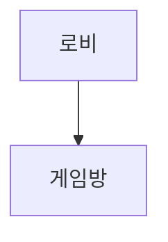
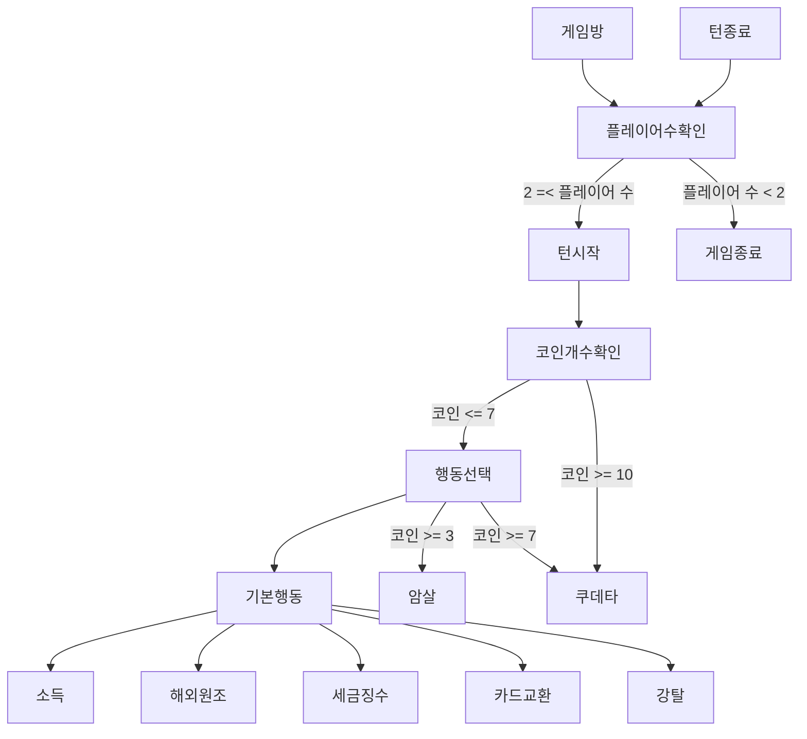
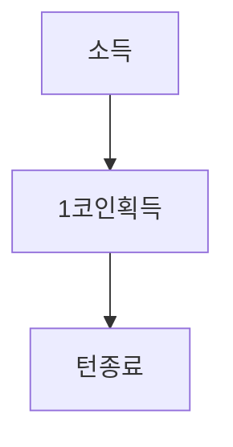
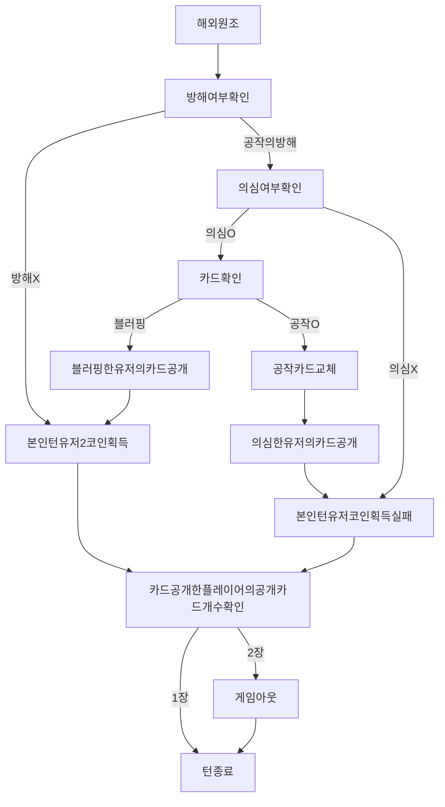
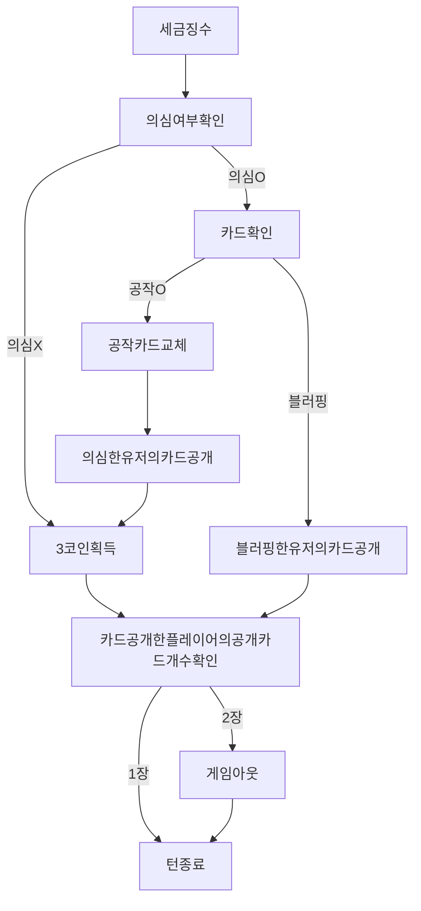
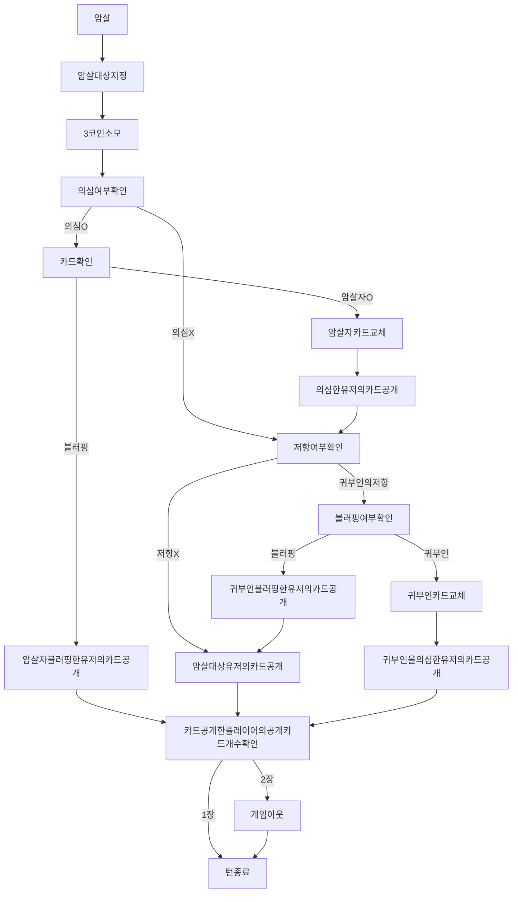
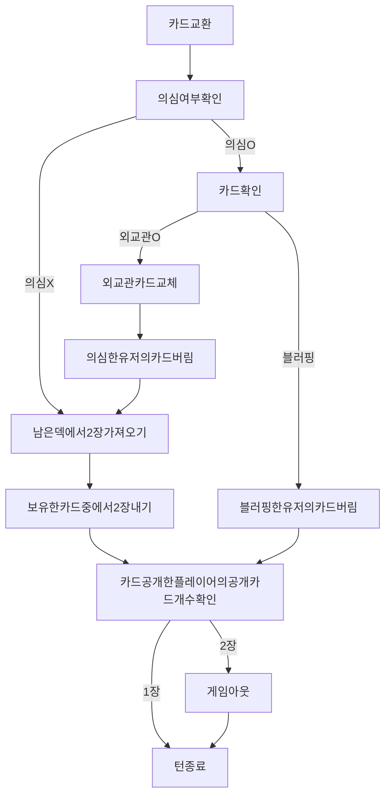
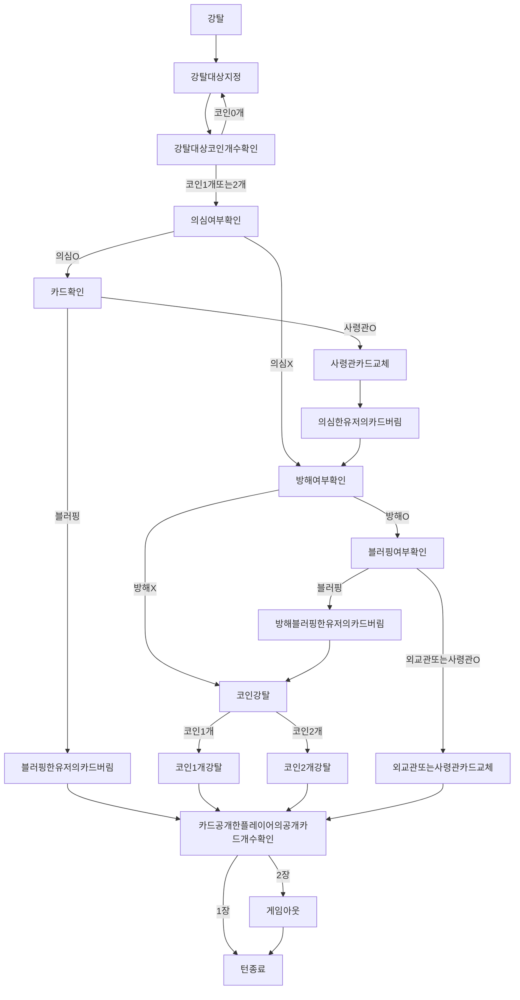
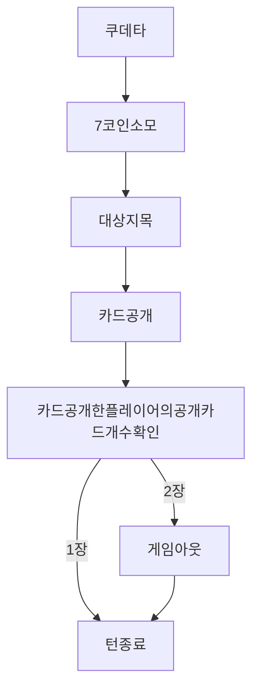

깃허브에서 이 파일을 열면 플로우차트 바로 보입니다.

vscode에서 플로우차트 보는 방법
1. vscode 'Markdown Preview Mermaid Support' extension 설치
2. Ctrl+Shift+v - 차트 미리보기 가능
3. Ctrl+k 누르고 Ctrl을 떼고 k만 누른 상태에서 v를 누르기 - 미리보기 그림과 코드 같이 보기 가능

